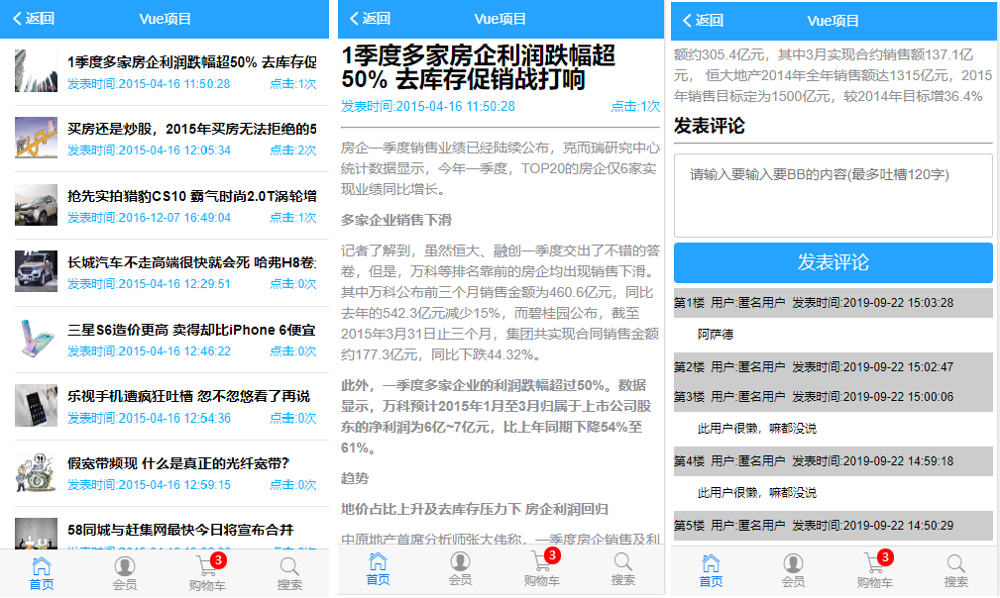
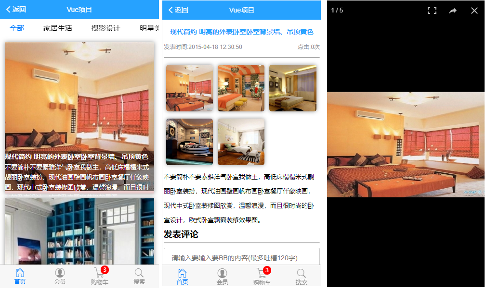
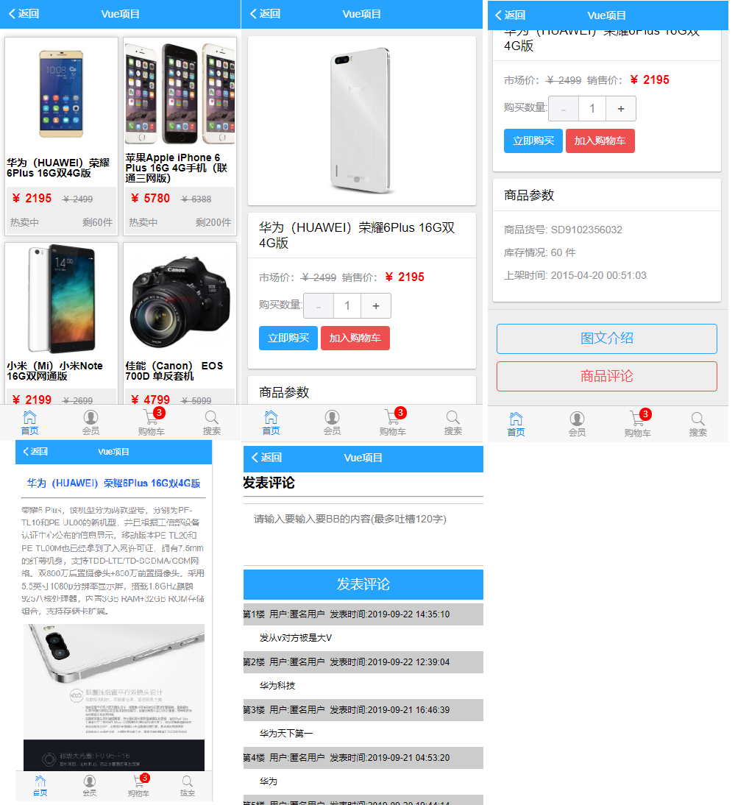
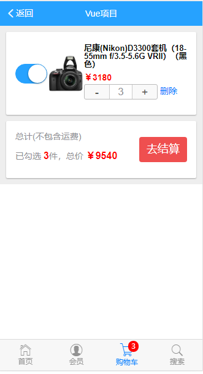

## Vue实现的项目 Vue项目实践
### 一个有灵魂的程序猿
[开源协议之间有何区别](https://www.zhihu.com/question/19568896)
## 传统方式将代码上传
1. git add .
2. git commit -m "提交信息"
3. git push 


## 制作首页App组件
1. 完成Hearder区域，使用Mint-UI中Header组件
2. 制作底部Tabbar区域，使用MUI的Tabbar.html
   + 在制作购物车小图标时，操作相对较多
   + 把扩展图标css样式，拷贝到项目中（icon-extra.css）
   + 拷贝字体图标 ttf文件，到项目中
   + 为购物车小图标，添加如下样式`mui-icon mui-icon-extra mui-icon-extra-cart`
3. 要在中间区域放置一个router-view 来展示路由匹配的组件

## 改造Tabbar为router-link
1. 设置路由高亮
2. 点击Tabbar中的路由链接，展示对应路由
## 首页
1. 制作首页轮播图布局
   + 加载首页数据
     1. 获取数据，使用vue-resource 
     2. 使用vue-resource的this.$http.get获取数据
     3. 数据保存到data上
     4. 使用v-for渲染每个item项 
2. 改造九宫格样式

## 改造新闻咨询，路由链接
## 新闻页面 制作
1. 绘制界面，使用MUI的media-list
2. 使用vue-resource获取数据
3. 渲染真实数据

## 实习新闻咨询列表 点击跳转到新闻详情
1. 把 每一项改造为router-link，同时跳转时提供唯一的id标识
2. 创建新闻详情的组件页面 NewsInfo.vue
3. 路由模块中，将新闻详情的路由地址和组件页面对应

## 实现新闻详情页面布局和渲染

## 单独封装一个comment.vue评论子组件
1. 先创建单独的comment.vue组件模板
2. 在需要使用comment组件的页面中，先手动导入comment组件`import comment from './comment.vue'`
3. 在父组件中，使用`comments`属性，将刚才导入comment组件，注册为自己的组件
4. 将注册子组件时候的，注册名称，以标签的形式，在页面中引用即可

## 获取所有的评论数据显示到页面中
1.geComments

## 实现点击加载更多
1. 为加载更多绑定监听事件，请求下一页数据
2. 点击加载更多。让pageIndex++ ,然后重新调用this.getComments()方法重新获取最新数据
3. 为防止新数据覆盖老数据，点击加载更多是，获取到的新数据，让老数据调用数组的concat方法，拼接上新数组

## 发表评论
1. 把文本框做双向数据绑定
2. 为发表按钮绑定事件
3. 校验内容是否为空，Toast提示用户，评论内容是否为空
4. 通过vue-resource发送一个请求，把评论类容提交给服务器
5. 当发表评论ok后，重新刷新列表，以查看最新评论
   + 如果调用getComments方法重新刷新列表，只能得到最后一页的评论，前几页的品论获取不到
   + 换种思路：当评论获取成功后，在客户端，手动拼接一个最新的评论对象，然后调用数组的unshift方法，把新评论，追加到data中comments的开头，这样就能完美实现刷新列表的需求
   
## 改造图片分享的按钮为路由链接

## 绘制图片列表组件页面结构美化样式
1. 制作顶部的滑动条
2. 制作底部的图片列表
### 制作顶部滑动的坑
1. 需借助MUI中的tab-top-webview-main.html
2. 需要把slider区域的mui-fullscreen类去掉
3. 滑动条无法正常滑动，检查官方文档发现这是js组件，需要初始化一下
   + 导入mui.js
   + 调用官方方式初始化
    ```
    mui('.mui-scroll-wrapper').scroll({
    	deceleration: 0.0005 //flick 减速系数，系数越大，滚动速度越慢，滚动距离越小，默认值0.0006
    });
4. 我们在初始化滑动条时候，导入mui.js 控制台报错：`Uncaught TypeError: 'caller', 'callee', and 'arguments' properties may not be accessed on strict mode functions or the arguments objects for calls to them `
   + 可能mui.js中用到了'caller','callee',and 'arguments'东西，但是webpack打包好的bundle.js中，默认启用严格模式，两者冲突
    + 解决方案：1. 把mui.js中的非严格模式的代码改掉，不现实；2. 把webpack打包时候的严格模式禁用
    + 最终选择了第二种方案移除严格模式
      1. npm i babel-plugin-transform-remove-strict-mode  
      2. 配置.babelrc文件"transform-remove-strict-mode"
5. 刚进入图片分享的时候，滑动无法正常工作，如果要初始化滑动条，必须等DOM元素加载完毕，所以把初始化滑动条搬动mounted生命周期函数中 
6. 当滑动条可以后，tabbar无法正常工作后，需要把 tabbar 按钮的样式中'mui-tab-item'重新改一下名字；
7. 获取所有分类并渲染分类列表
### 制作图片列表区域
1. 图片列表需要使用懒加载技术，使用Mint-UI提供的现成的组件lazy-load
2. 根据lazy-load使用文档尝试使用
3. 渲染图片列表数据
### 实现图片列表的懒加载和样式美化
## 实现点击图片跳转到图片详情页面
1. 改造li成router-link的时候，需要使用tag属性指定渲染为哪种元素
## 实现详情页面的布局和美化，同时获取数据渲染页面
## 实现图片详情中的缩略图的功能
1. 使用插件vue-preview这个缩略图插件
2. 获取所有的图片列表，然后使用v-for指令渲染数据
3. 注意：img标签上的class不能去掉
4. 注意：每个图片数据对象中必须有w和h属性
## 绘制商品列表页面基本结构并美化

## 尝试在手机上进行项目预览和测试
1. 保证手机可以正常运行
2. 保证手机和电脑处于同一个WiFi环境中，手机可以访问电脑的ip
3. 打开项目中的package.json文件，在dev脚本中，添加一个 --host指令，把当前电脑的wifi ip地址，设置为--host的指令值
   + 如何查看wifi的ip，cmd运行‘ipconfig’，查看无线网的ip地址
   
   
### 页面效果图展示
**主页**


**新闻**



**图片分享**

 

**商品列表**



**购物车**

